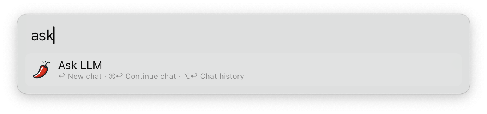
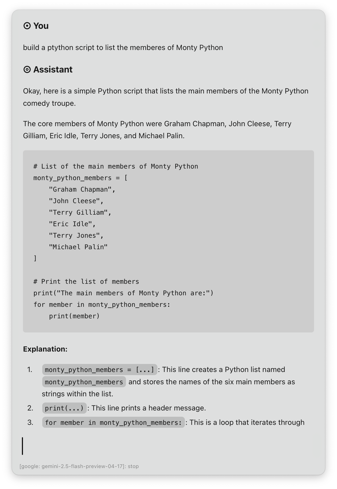
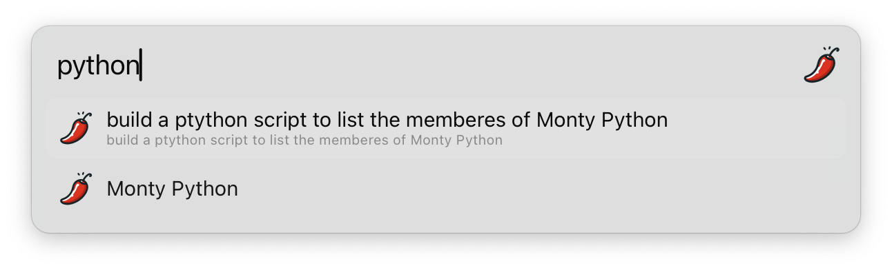

# La 🌶️ - An LLM Alfred Workflow

## Setup

Please create a configuration file, such as `~/.config/alfred/la.json`, tailored to your specific needs. This configuration file should be structured into two main sections: `providers` for your Large Language Model (LLM) providers and `tasks` for the tasks you want the LLMs to perform.

Each `provider` entry should include the following:

*   `endpoint`: The API endpoint URL for the LLM provider.
*   `api_key`: Your API key for authentication.
*   `models`: A list of the models available from that provider.

Each `task` entry should potentially specify:

*   `provider`: The name of the provider to use.
*   `model`: The specific model to use from the chosen provider.
*   `parameters`: Any specific parameters to pass to the model (e.g., temperature, top_p).
*   `prompts`: The prompts to be used for the task. Prompts can be either:
    *   Plain text strings.
    *   Paths to Markdown files located in a `./prompts` directory relative to the configuration file's location.
    *   Support for `extra` prompts, which can be used for shared prompts across multiple tasks.
*   `tools`: (Optional) If the model supports tool use, this section allows you to configure the tools to be used within the task.

```
{
  "providers": {
    "google": {
      "endpoint": "https://generativelanguage.googleapis.com/v1beta/models",
      "api_key": "",
      "models": {
        "gemini-2.5-flash": "gemini-2.5-flash-preview-04-17",
        "gemini-2.0-flash": "gemini-2.0-flash"
      }
    },
    "google_openai": {
      "endpoint": "https://generativelanguage.googleapis.com/v1beta/openai/chat/completions",
      "api_key": "",
      "models": {
        "gemini-2.0-flash-lite": "gemini-2.0-flash-lite-preview-02-05",
        "learnlm-1.5-pro": "learnlm-1.5-pro-experimental"
      }
    },
    "groq": {
      "endpoint": "https://api.groq.com/openai/v1/chat/completions",
      "api_key": "",
      "models": {
        "qwen-qwq-32b": "qwen-qwq-32b"
      }
    }
  },
  "tasks": {
    "explain": {
      "provider": "google_openai",
      "model": "gemini-2.0-flash",
      "parameters": {
        "temperature": 0.3,
        "maxTokens": 8192
      },
      "prompts": "explain.md"
    },
    "ask": {
      "provider": "google",
      "model": "gemini-2.5-flash",
      "parameters": {
        "temperature": 0.1
      },
      "tools": [
        {
          "googleSearch": {}
        }
      ],
      "max_context": 4,
      "prompts": "You are Gemini, an AI assistant created by Google.",
      "extra": "profile.md"
    }
  }
}
```

## Usage

### Chat

Query LLM via the `ask` keyword, the [Universal Action](https://www.alfredapp.com/help/features/universal-actions/), or the [Fallback Search](https://www.alfredapp.com/help/features/default-results/fallback-searches/).





- <kbd>↩&#xFE0E;</kbd> Ask a new question.
- <kbd>⌘</kbd><kbd>↩&#xFE0E;</kbd> Continue chat.
- <kbd>⌥</kbd><kbd>↩&#xFE0E;</kbd> Copy last answer.
- <kbd>⌃</kbd><kbd>↩&#xFE0E;</kbd> Copy full chat.
- <kbd>⇧</kbd><kbd>↩&#xFE0E;</kbd> Stop generating answer.

#### Chat History

View Chat History with ⌥↩&#xFE0E; in the `ask` keyword. Each result shows the first question as the title and the last as the subtitle.



<kbd>↩&#xFE0E;</kbd> to archive the current chat and load the selected one. Older chats can be trashed with the `Delete` [Universal Action](https://www.alfredapp.com/help/features/universal-actions/). Select multiple chats with the [File Buffer](https://www.alfredapp.com/help/features/file-search/#file-buffer).
